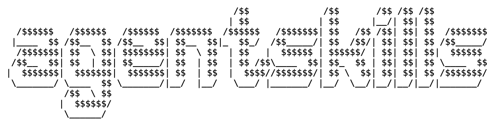

<!-- # >> agentskills -->



My personal set of skills for AI coding agents — the ones I actually use.  
Made for the ✨ vive‑coding workflow.


# Installation

Install all skills from this repository:
```bash
npx skills add albertolicea00/agent-skills
```
